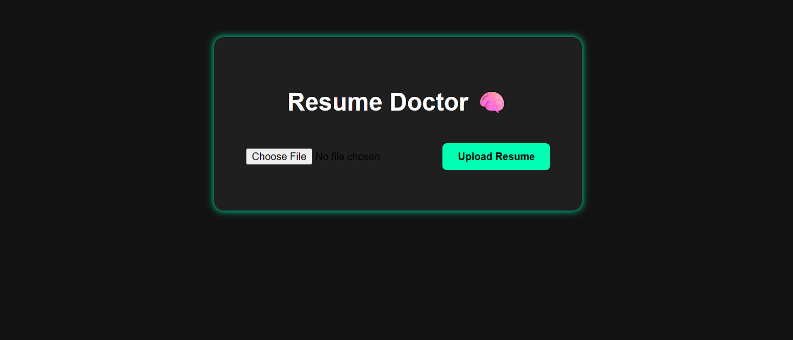
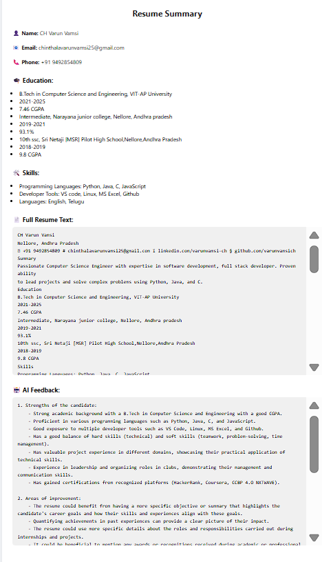
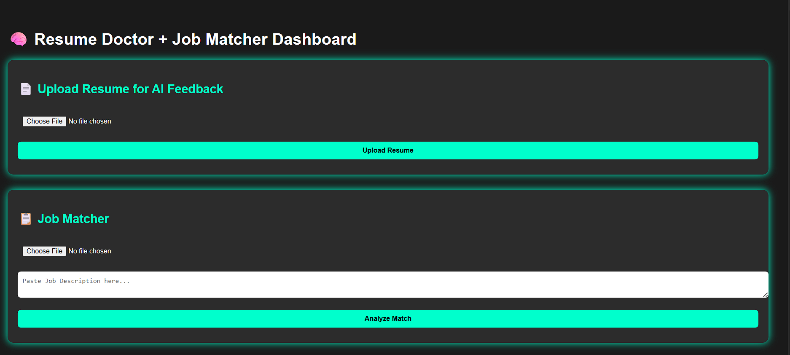

# 🧠 Resume Doctor

A **Flask-based Resume Upload Web App**  
This project allows users to upload their resumes securely and prepares the backend system for future AI analysis (skill extraction, scoring, suggestions, etc.).

## ✅ Phase 1 Features:
- Resume Upload Form
- File Upload Handling
- Dark-themed UI
- Flask Backend Setup

---

## 🛠️ Tech Used
- HTML, CSS
- Python (Flask)
- JavaScript (in future phase)

---

## 🚀 Phase 2 – Resume Text Extraction + Email & Phone Detection

### 🔧 Features Implemented:
- Extracts full resume text using `PyMuPDF`
- Automatically detects and displays:
  - 📧 Email address
  - 📞 Phone number
- Clean and scrollable resume preview
- Beautiful UI using custom CSS inside `summary.html`

### 🖥️ How It Works:
- Upload any `.pdf` resume
- The app extracts and displays:
  - Email
  - Phone
  - Full resume text

### 📁 Files Added / Modified:
- `app.py` – Added PyMuPDF logic, email & phone extract
- `summary.html` – Output UI for resume details

---

✅ Phase-2 makes our app smarter and user-friendly.  
Get ready for Phase-2.5 where we extract **Name, Education, and Skills**!

### ✅ Phase-2.5: Smart Resume Data Extraction

In this phase, we added real-time extraction of:

- 📛 Name
- 📧 Email
- 📞 Phone Number
- 🎓 Education Details
- 🛠️ Skills
- 📃 Full Resume Text

🧠 Built using PyMuPDF, Regular Expressions, and Flask.

💡 Outputs cleanly rendered on a summary page after resume upload.

## 🔥 Phase-3: AI Feedback Integration using OpenAI

In this phase, we added powerful AI features to our Resume Doctor project using **OpenAI GPT-4**. Now, after a resume is uploaded, the system performs:

- ✅ Extraction of name, email, phone, education, and skills
- ✅ Full resume text extraction using PyMuPDF
- ✅ Real-time AI feedback with GPT-4:
  - Strengths of the candidate
  - Areas of improvement
  - Suitable job roles
  - Recommended skills to learn

### 🔐 API Key Protection

To keep the API key secure and production-ready:
- The key is stored in a `.env` file (not in the code)
- `python-dotenv` is used to load the `.env` file
- `.env` is added to `.gitignore` so it's never pushed to GitHub

---

## 🔥 Phase-4: Deployment & Hosting (Live on Render.com)

In this phase, we deployed Resume Doctor to the internet using **Render.com (Free Instance)** and made the app accessible globally 🌐.

### ✅ Key Implementations:

- Created `requirements.txt` with all dependencies
- Installed and added `gunicorn` for production server
- Added `Procfile` for Render startup command
- Secured OpenAI key using `.env` file
- Deployed to Render with:
  - Build Command: `pip install -r requirements.txt`
  - Start Command: `gunicorn app:app`
- Set environment variable `OPENAI_API_KEY` on Render
- Connected UptimeRobot to keep the app alive 24/7 🚀

### 🌐 Live Demo:
[Resume Doctor – Try it Live](https://resume-doctor.onrender.com)

## 📸 Screenshots

### 🔹 Upload Page

### 🔹 Summary Output

## 🔍 Phase-5: Resume Ranker + Job Matcher System

- Added a new feature with route `/job-matcher`
- User can:
  - 📄 Upload Resume (PDF)
  - 📋 Paste Job Description
- AI (GPT-4) compares resume with the job description and provides:
  - ✅ Match Score (out of 100)
  - 🔍 Missing Keywords
  - 💡 Suggestions to Improve Resume
  - 🧾 Summary of Suitability

This helps users tailor their resumes for specific job roles more effectively! 💼✨

> 🚀 Resume Doctor is now smarter with job relevance analysis!
---

## 🔥 Phase-6: Combined Dashboard UI – Resume Analyzer + Job Matcher

In this phase, we merged both AI Resume Feedback and Job Matcher System into a single, clean dashboard (`dashboard.html`).

### ✅ Features:
- 📄 Resume Upload for GPT-4 Analysis
- 📋 Job Description Match in same UI
- 💡 Cleaner UI & simpler workflow
- 🛠️ Updated routing (`/`, `/upload`, `/match`)
### 🧠 Combined Dashboard

---

## 🔄 PHASE-7: AI Resume Rebuilder (🎯 Completed)

🎯 Goal: Automatically generate a clean, modern, ATS-optimized resume using GPT-4.

### 🔧 Features:
- 📄 Upload an existing resume (PDF)
- 🤖 GPT-4 rewrites it with:
  - ✨ Strong action verbs  
  - 🧠 Clear ATS formatting  
  - 📌 Bullet points & headings
- 📺 Output is shown on-screen for preview

💡 Future Enhancements:
- 📝 Allow editing before download  
- 📥 Download as PDF/DOCX  

### 🧪 Try it Live:
👉 [Resume Doctor App](https://resume-doctor.onrender.com)

### 📸 Screenshot:

